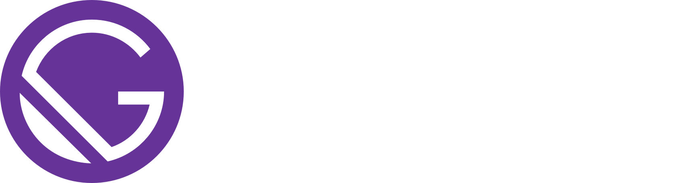
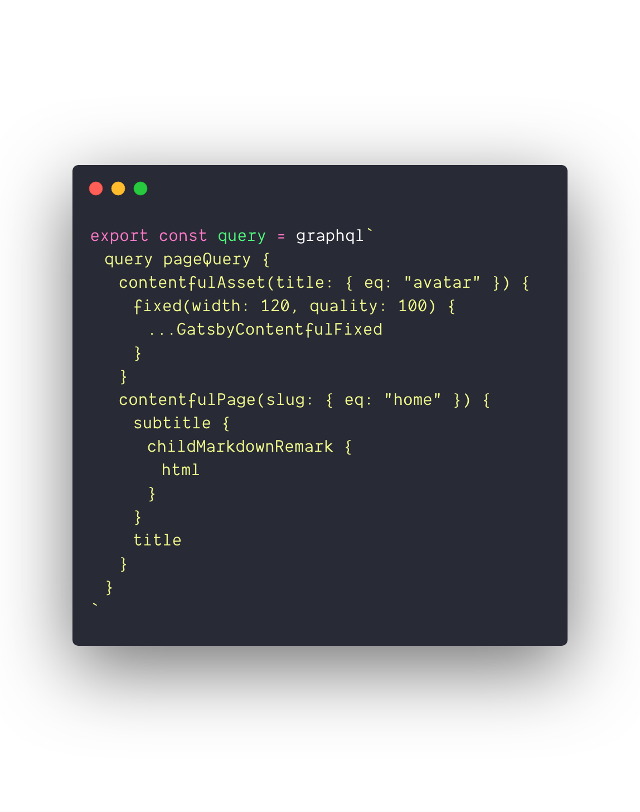
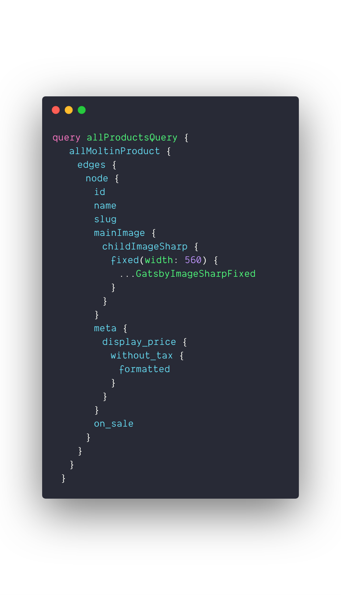

import layout from './layout'

import { Notes } from '@mdx-deck/components'

export { default as theme } from './theme'

export default layout

# Blazing fast Moltin sites

With Gatsby.js

---

export default layout

<Notes>
  • JAMstack is a term that has been around for about 5-6 years now. •
  JavaScript, APIs, Markup. • Definition: Modern workflow and architecture for
  building web applications. • Developer tooling available today makes this the
  'golden era' of JAMstack.
</Notes>

---

export default layout

# Why?

What advantages does JAMstack bring to eCommerce developers

<Notes>
  • Primary use cases for JAMstack orientated sites have primarily been for
  blogs and product marketing sites. • But the benefits of the JAMstack are
  heavily suited to the eCommerce industry.
</Notes>

---

export default layout

# 1. Performance

Serve pre-built assets over a CDN, with a focus on SEO

<Notes>
  • Static assets mean they can be served via a CDN like Netlify. • Super fast
  product catalogue, which is SEO friendly by its very nature.
</Notes>

---

export default layout

# 2. Infinite scaling

Seamless and affordable (often free) scaling

<Notes>
  • CDN approach of hosting means your site will scale infinitely with very
  little (if any) additional cost. • This loans itself well to the concept of
  viral marketing and pop-up shops.
</Notes>

---

export default layout

# 3. Better DX

Automated builds, atomic deploys, cache invalidation

<Notes>
  • Automated, atomic deploys can be triggered with version control and build
  hooks. • Using tools such as Netlify or Zeit Now, these deployments are fast
  with instant cache invalidation.
</Notes>

---

export default layout

# 4. Security

No server side components lessens the surface of potential security concerns

<Notes>• No servers or databases to worry about vulnerabilities.</Notes>

---

export default layout

<Notes>
  • There's one JavaScript framework that has become synonmous with JAMstack in
  the past couple of years and that's Gatsby. • Gatsby is static site generator
  built on React. It allows developers to build dynamic sites and applications
  within the React ecosystem, that are compiled to static pages using Gatsby's
  powerful static build system.
</Notes>

---

export default layout

# Data fetching

GraphQL, source plugins and more

<Notes>
  • One of the key components of modern day web applications is data fetching,
  and this is an area that Gatsby excels in. • Out-of-the Gatsby provides a
  GraphQL layer to query data from a variety of sources. Whether that be a REST
  API, local Markdown files for your blog or a headless CMS. • The Gatsby
  community is thriving with third-party source plugins for a wide array of
  datasources including Contentful, Instagram and WordPress.
</Notes>

---

export default layout

<Notes>
  • This is an example of a page query in Gatsby using GraphQL. • These queries
  are ran during the build process and the returned data is used to render the
  static HTML page according to your React component. • These queries are made
  available in a application scoped GraphQL schema, built dynamically from your
  configured Gatsby sources. • You can query data from multiple sources, using a
  multitude of Gatsby source plugins. Chances are there's a community built
  Gatsby source plugin for the API you're trying to query.
</Notes>

---

export default layout

# JAMcommerce

Empowering eCommerce developers with Gatsby

<Notes>
  • Nautrally Gatsby's powerful build tools and APIs are an excellent match
  Moltin's headless commerce API. • We can enable the eCommerce builders of
  today to build super fast, scalable eCommerce sites.
</Notes>

---

export default layout

# An interface to Moltin

`gatsby-source-moltin`

<Notes>
  • `gatsby-source-moltin` is an open-source Gatsby source plugin that wraps our
  REST API and creates Gatsby nodes ready to be queried from the generated
  GraphQL schema. • This gives Gatsby developers the flexibility to build Moltin
  powered eCommerce Gatsby sites easily at scale.
</Notes>

---

export default layout

<Notes>
  • Query for your product data using the GraphQL schema generated by Gatsby at
  build. • The JSON data returned from this can be used in your React components
  to create product pages as you desire.
</Notes>

---

export default layout

# Powerful build tools and APIs

`gatsby-image` and programatic page creation

<Notes>
  • Gatsby also exposes a number of build hooks that assist in the programatic
  creation of pages. • You can define a React component as a 'template', and a
  static page will be created for each resource during the build. • Pair this
  with the Moltin events API, and builds can be triggered whenever a product is
  created, updated or deleted. • `gatsby-image` assists in the optimisation on
  image assets. It'll create local copies of your remote image assets, as well
  as provide best practice for lazy loading product images attached to your
  Moltin products.
</Notes>

---

export default layout

# Demo

Getting started with Gatsby ⨯ Moltin

---
